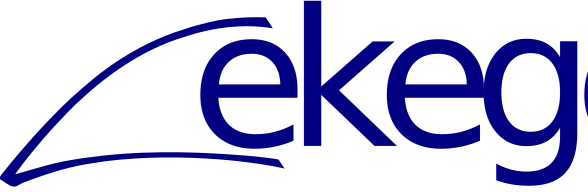

    
    

Ekege is an E-graph library for Rust. Essentially, a reimplementation of [`egglog`](`https://github.com/egraphs-good/egglog`). It sports less features, and is less developed. Eventual plans are to make it faster than `egglog`, with support for free variables.
